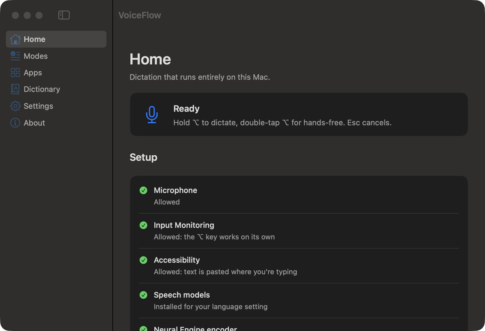
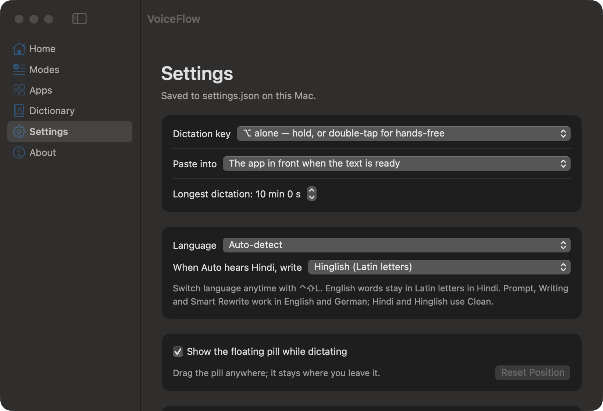

# VoiceFlow

**Hold ⌥, speak, release — the text appears where you were typing.** A macOS menu-bar dictation app for developers that
runs entirely on your Mac: no cloud, no accounts, no telemetry, and nothing you say is ever stored.

[](LICENSE)
[](#requirements)
[](#requirements)
[](Package.swift)

On the maintainer's recordings: **1.1% word error, 97.4% of technical terms recognized**, text pasted **0.6–0.9 s** after
you release the key. Idle cost: **13 MB and no measurable CPU**.



## Why

Cloud dictation sends your microphone to someone else's computer and still writes "get user by ID" as "get user by eye
dee". VoiceFlow keeps everything local and is tuned for the words developers actually say: `package.json`, `--save-dev`,
`user_id`, `kubectl get pods`, `useEffect`, `.env.local`.

Everything it writes is either what the recognizer heard or a rule you can read in the source. The optional on-device
rewrite is checked by a deterministic guard that rejects any change to your words — it can fix punctuation, never content.

## Features

- **One-key dictation.** Hold ⌥ to dictate, double-tap for hands-free, Esc to cancel. ⌥Space works as a fallback.
- **Accurate developer speech.** Whisper (whisper.cpp, Neural Engine) with a developer vocabulary prompt.
- **Text modes.** Raw · Clean · Developer · Prompt · Writing · Code — rules first, model only when it helps.
- **Mode per app.** VS Code → Developer, Slack → Clean, ChatGPT → Prompt, Notes → Writing. Configurable.
- **Four languages.** English, German, Hindi (Devanagari) and Hinglish, auto-detected or fixed per app.
- **Your dictionary.** Your terms and spoken→written replacements, in a plain JSON file.
- **A pill while dictating.** Live input level, finish and cancel buttons; drag it anywhere, it stays there.
- **Careful with your clipboard.** Saved before pasting and restored afterwards; text is never lost if pasting fails.


## Requirements

- **macOS 27 (Tahoe) or later**, Apple Silicon (arm64)
- **Command Line Tools** (`xcode-select --install`). Xcode is not needed.
- **~1.4 GB of disk** for the English model (more per extra language)
- Apple Intelligence enabled, only for the optional rewrite modes (Prompt, Writing, Smart Rewrite)

## Install

```sh
git clone git@github.com:tejasnirala/voice-flow.git && cd voice-flow
scripts/install.sh --with-models      # fetches the runtime + English model (checksum verified), builds, tests, installs
```

`scripts/install.sh` alone updates an existing install; `scripts/install.sh --with-languages` adds German, Hindi and
Hinglish; `scripts/uninstall.sh [--purge]` removes it.

On first use macOS asks for **Microphone**, **Input Monitoring** (for the ⌥ trigger) and **Accessibility** (to paste).
The window's Home page shows what is still missing and fixes it with one click.

## Using it

1. Put the cursor where the text should go.
2. Hold **⌥** and speak. Release when done. (Double-tap **⌥** to keep recording hands-free; press **⌥** again to finish.)
3. The text is pasted into whatever app is in front when it's ready.

Menu bar → **Mode** picks how your words are written; **Language** picks the language; **Open VoiceFlow…** opens the
window. **⌃⇧L** cycles languages. **Esc** cancels a recording.

### Text modes

| Mode | What it does |
|---|---|
| **Raw** | Exactly what the recognizer produced |
| **Clean** (default) | Removes "um" and stutters, fixes capitals and punctuation |
| **Developer** | Clean + `package.json`, `--save`, `user_id`, `kubectl get pods`, `useEffect`, `DATABASE_URL` |
| **Prompt** | Turns rambling speech into a clear prompt for an AI assistant (on-device model) |
| **Writing** | Polished sentences for messages and notes (on-device model) |
| **Code** | For terminals and editors: "git checkout dash b feature slash login" → `git checkout -b feature/login` |

Spoken lists become bullet points ("two things: one is…, the second is…"). **Smart Rewrite** additionally runs the
on-device model over Clean and Developer text. Every model rewrite is checked: if it adds, drops, replaces or reorders
any of your words, it's discarded and the rule-based text is used.



## Languages

**Auto-detect** (default) recognizes English, German or Hindi in about 0.5 s and writes accordingly. **⌃⇧L** switches to a
fixed language, and each app can have its own (e.g. WhatsApp → Hinglish) — useful because very short utterances are hard
to detect, and an app rule is both certain and 0.5 s faster.

Hindi keeps English words in Latin ("इस function में getUserById call करो"). Hinglish is produced from the Devanagari
transcript by rules (3.5% word error), because asking Whisper for Hinglish directly gives mixed scripts and 20–40% error.
Prompt, Writing and Smart Rewrite work in English and German only: Apple's on-device model has no Hindi.

**Models per language** (`~/Library/Application Support/VoiceFlow/models/whisper/`, installed by `scripts/fetch-models.sh`,
SHA-256 verified; nothing is ever downloaded while dictating):

| Language | Model files | Size | Install |
|---|---|---|---|
| English | `ggml-medium.en-q8_0.bin` + `ggml-medium.en-encoder.mlmodelc` | 1.4 GB | `scripts/fetch-models.sh whisper medium.en-q8_0 && scripts/fetch-models.sh whisper-coreml medium.en` |
| Hindi, Hinglish **and language detection** | `ggml-large-v3-turbo-q8_0.bin` + `ggml-large-v3-turbo-encoder.mlmodelc` | 2.0 GB | `scripts/fetch-models.sh whisper large-v3-turbo-q8_0 && scripts/fetch-models.sh whisper-coreml large-v3-turbo` |
| German (optional) | `ggml-large-v3-q5_0.bin` + `ggml-large-v3-encoder.mlmodelc` | 2.2 GB | `scripts/fetch-models.sh whisper large-v3-q5_0 && scripts/fetch-models.sh whisper-coreml large-v3` |

Without the German model, German still works through the Hindi/detection model, just less accurately (11.3% vs 8.8% word
error). Installing it needs no settings change; the first dictation afterwards spends ~15–20 s compiling it once.

## Privacy

- **No network at runtime.** There is no networking code in the app; verified with `lsof` during a full dictation: zero
  sockets, zero files written ([docs/AUDIT.md](docs/AUDIT.md) §3).
- **Nothing is stored.** Audio stays in memory; transcripts live only in memory for the menu's "Last dictation".
- **Logs contain metadata only** — timings, counts, app bundle IDs — never what you said.
- **Your clipboard is restored** after each paste, unless you changed it meanwhile.
- **What is written to disk:** `settings.json` and `dictionary.json` in `~/Library/Application Support/VoiceFlow/`.
- Speech recognition runs in a separate helper process that exits 60 s after your last dictation, returning its ~1.1 GB.

## How it works

```
⌥ key → AVAudioEngine (16 kHz mono, in memory) → voiceflow-stt helper (whisper.cpp, Neural Engine)
      → transcript guard → language conversion → text mode rules → optional on-device rewrite + guard
      → clipboard snapshot → ⌘V → clipboard restored
```

The app itself never loads the speech runtime; only the helper does, so all model memory is returned when it exits.
Design decisions and the alternatives that were measured and rejected are in
[docs/ARCHITECTURE.md](docs/ARCHITECTURE.md).

## Measurements

Every number in this repository was measured on the maintainer's MacBook Air M4 (16 GB) and is reproducible with the
scripts in `scripts/bench/`. Accuracy decisions are made on **recordings of real speech**; synthetic voices are only used
to shortlist.

| | Result |
|---|---|
| Word error / technical terms (owner's 50 English recordings) | 1.1% / 97.4% |
| Hindi (owner's 24 recordings), Devanagari / Hinglish | 5.7% / 3.5% |
| German (synthetic voices only) | 8.8% |
| Release → pasted, short English dictation | 0.6–0.9 s |
| Idle | 13 MB, no measurable CPU, no GPU |

Full results: [docs/ACCURACY.md](docs/ACCURACY.md), [docs/PERFORMANCE.md](docs/PERFORMANCE.md),
[docs/AUDIT.md](docs/AUDIT.md).

## Development

```sh
scripts/fetch-deps.sh                          # whisper.cpp xcframework → Vendor/ (checksum verified)
scripts/build-app.sh && open build/VoiceFlow.app
scripts/test.sh                                # 165 tests (plain `swift test` fails with Command Line Tools only)
```

SwiftPM only, no Xcode project, no Swift package dependencies. See [CONTRIBUTING.md](CONTRIBUTING.md) and
[docs/DEVELOPMENT.md](docs/DEVELOPMENT.md) (benchmark commands, debugging, gotchas).

| Doc | Contents |
|---|---|
| [docs/SPEC.md](docs/SPEC.md) | Requirements this project is built against |
| [docs/ARCHITECTURE.md](docs/ARCHITECTURE.md) | Stack, alternatives considered, model decisions, privacy |
| [docs/ACCURACY.md](docs/ACCURACY.md) | Corpora, metrics, thresholds, every accuracy result |
| [docs/PERFORMANCE.md](docs/PERFORMANCE.md) | Methodology and every latency/memory measurement |
| [docs/AUDIT.md](docs/AUDIT.md) | Final audit: accuracy, performance, privacy, reliability, UX, limitations |
| [docs/DEVELOPMENT.md](docs/DEVELOPMENT.md) | Setup, commands, benchmarks, debugging |
| [docs/PROGRESS.md](docs/PROGRESS.md) | Build log by phase, decision log |

## Known limitations

- macOS 27+ on Apple Silicon only; signed locally, not notarized (macOS may ask you to allow it).
- German is not verified on real speech, only synthetic voices.
- Prompt and Writing fall back to Clean in Hindi and Hinglish (no Hindi in Apple's on-device model).
- Very short utterances are hard to auto-detect; set a language per app where you mostly speak one.
- AirPods start capturing ~0.5 s after the key press; the pill turns red when audio is actually flowing.

## Contributing

Issues and pull requests are welcome — please read [CONTRIBUTING.md](CONTRIBUTING.md) first. It explains the project's
rules: accuracy before speed, local only, never store or log what the user says, and never fabricate benchmark numbers.
Security or privacy problems: [SECURITY.md](SECURITY.md).

## License

[MIT](LICENSE) © 2026 Tejas Nirala. Third-party components (whisper.cpp, Whisper models) and their licenses:
[THIRD_PARTY_NOTICES.md](THIRD_PARTY_NOTICES.md).

Built with [whisper.cpp](https://github.com/ggml-org/whisper.cpp) and OpenAI's Whisper models.
